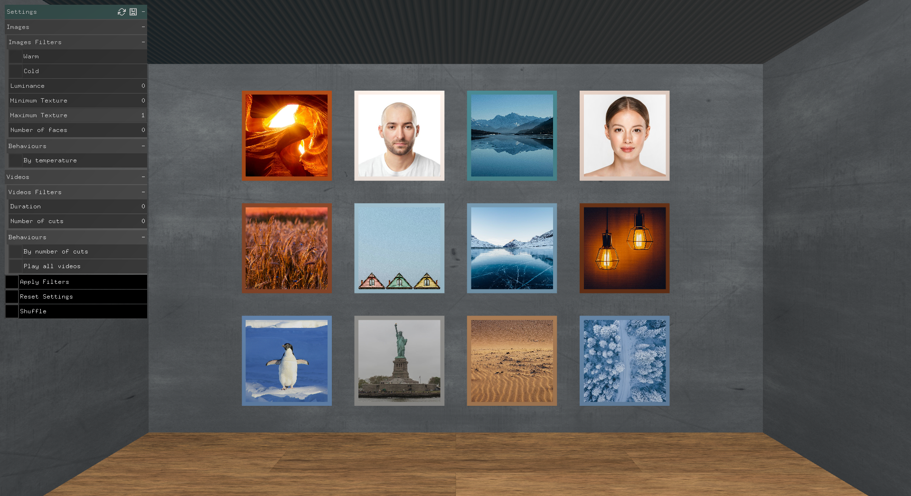
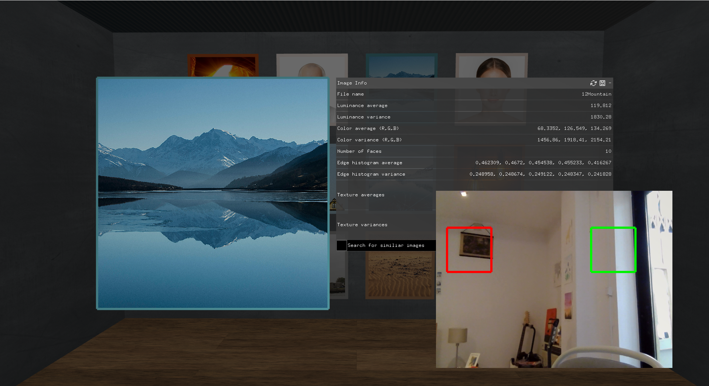

# 3D Gallery

An interactive 3D virtual gallery built with C++ and OpenFrameworks, where users can browse, view and interact with images and videos displayed on 3D walls. The system automatically extracts metadata from each media object and supports filtering, grouping, and gesture-based navigation.

  | | |
  |---|---|
  |  |  |

---

## Demo

> Video demo and screenshots coming soon.

---

## Features

### Media Display
- Navigable 3D environment with interactive camera (click and drag)
- Images and videos displayed on opposite walls of a 3D room
- Each image has a frame colored with its average color; videos have a red frame
- Selecting a media object opens a detail view with a semi-transparent overlay and full metadata panel

### Automatic Metadata Extraction

**Images**
- Average and variance of color and luminance
- Edge histograms (5 directional masks via `filter2D`)
- Texture histograms (Gabor filters — 6 orientations × 4 frequencies = 24 filtered images)
- Number of faces detected (Haar Cascade via OpenCV)
- ORB keypoints and descriptors (used for similarity search)
- Color temperature classification (warm/cold based on Hue)

**Videos**
- Duration
- Number of cuts (histogram difference between frames, threshold = 0.3)

### Filtering & Grouping
- Filter images by luminance (slider — shows images above the selected value)
- Filter images by color temperature (warm / cold)
- Filter images by number of detected faces
- Filter videos by number of cuts
- Similarity search: reorganizes the gallery by decreasing similarity to the selected image (using ORB descriptor matching)
- Shuffle: randomly reorders the displayed media

### Dynamic Behaviors
- Images rotate at a speed proportional to their color temperature (warm = faster)
- Videos rotate at a speed proportional to their number of cuts
- Option to play all videos simultaneously

### Navigation & Interaction
- **Mouse**: click and drag to move the camera; click on an object to select it
- **Arrow keys**: navigate between images/videos
- **Spacebar**: play/pause the selected video
- **Gesture detection (key C)**: activates the webcam in mirror mode
  - Swipe in the right zone (green square) → next media
  - Swipe in the left zone (red square) → previous media

---

## Technologies

| Technology | Purpose |
|---|---|
| C++ | Core language |
| OpenFrameworks 0.12 | Creative multimedia framework |
| OpenGL | 3D rendering |
| ofxCv / OpenCV | Face detection, edge/texture analysis, ORB keypoints |
| ofxGui | UI panels |
| ofxXmlSettings | Metadata persistence (XML) |
| FMOD | Audio |
| FreeImage | Image loading |
| Visual Studio 2022 | IDE |

---

## Architecture

```
src/
├── main.cpp
├── ofApp               # Application entry point, setup/update/draw loop
├── gallery             # 3D scene management, wall layout, filter application
├── media               # Abstract base class for media objects
├── imageMedia          # Image-specific metadata and rendering
├── videoMedia          # Video-specific metadata and rendering
├── mediaMetadata       # XML read/write for all metadata
├── mediaInfoPanel      # Detail panel UI (shown when an object is selected)
├── mainPanel           # Main settings panel (filters and behaviors)
└── userInteractions    # Keyboard input and gesture detection via webcam
```
---

## How It Works

### Setup
On startup, the application configures the 3D environment (camera, lights, walls) and loads all media. For each image/video, it reads the corresponding XML file in `bin/data/xmlFiles/`. If the file does not exist it is created automatically, triggering full metadata extraction. ORB keypoints are always recomputed regardless.

### Update & Draw
On each frame, the app checks active filters and rebuilds the visible media list accordingly. If gesture detection is active, it checks for motion in the two detection zones. The scene is then drawn: walls/ceiling/floor as planes, then media objects, then the selected-object overlay if applicable.

### Metadata Algorithms

**Luminance extraction per pixel:**
```
luminance = 0.2125 * R + 0.7154 * G + 0.0721 * B
```

**Histogram difference (cut detection):**
```
D(I1, I2) = Σ|H(I1,i) - H(I2,i)| / totalPixels
```
A cut is registered when D > 0.3. Frames are sampled every 5 frames.

**Color temperature:** based on the Hue of the average color. Hue in [60, 240] → cold; otherwise → warm.

**Similarity search:** ORB descriptors are matched between the selected image and all others using the `match` method. Images with a match difference below 70 are considered similar. Results are sorted by decreasing similarity.

---

## Getting Started

### Requirements
- Windows 10 or 11 (64-bit)
- No installation required

### Run
1. Download `3DGallery-Windows.zip` from the [Releases](https://github.com/beatrizSPR9/3D-gallery/releases/latest) page
2. Extract the archive
3. Run `CmProject.exe`

### Build from source
1. Install [OpenFrameworks 0.12.0 (VS)](https://openframeworks.cc/download/) to `C:\of\`
2. Install the addons: `ofxOpenCv`, `ofxCv`, `ofxGui`, `ofxXmlSettings`
3. Copy this repository into `C:\of\apps\myApps\`
4. Open `CmProject.sln` in Visual Studio 2022 and build in Release x64

---

## Controls Summary

| Input | Action |
|---|---|
| Click + drag | Rotate camera |
| Click on object | Select / deselect |
| Arrow Right / Left | Next / previous media |
| Spacebar | Play / pause selected video |
| C | Toggle gesture detection camera |
| Swipe right zone | Next media (gesture) |
| Swipe left zone | Previous media (gesture) |

---

## Related Work

This project was inspired by virtual gallery platforms such as [Virtual Art Gallery](https://virtualartgallery.com), [Exhibbit](https://exhibbit.com), and [Artspaces](https://artspaces.kunstmatrix.com). The OpenFrameworks examples used as a foundation include `listDirExample`, `easyCam`, `xmlSettings`, `opencvHaarFinder`, and `videoGrabber`.

---

## License

This project was developed for academic purposes.  
Built with [OpenFrameworks](https://openframeworks.cc) · Beatriz Pires Rosas
